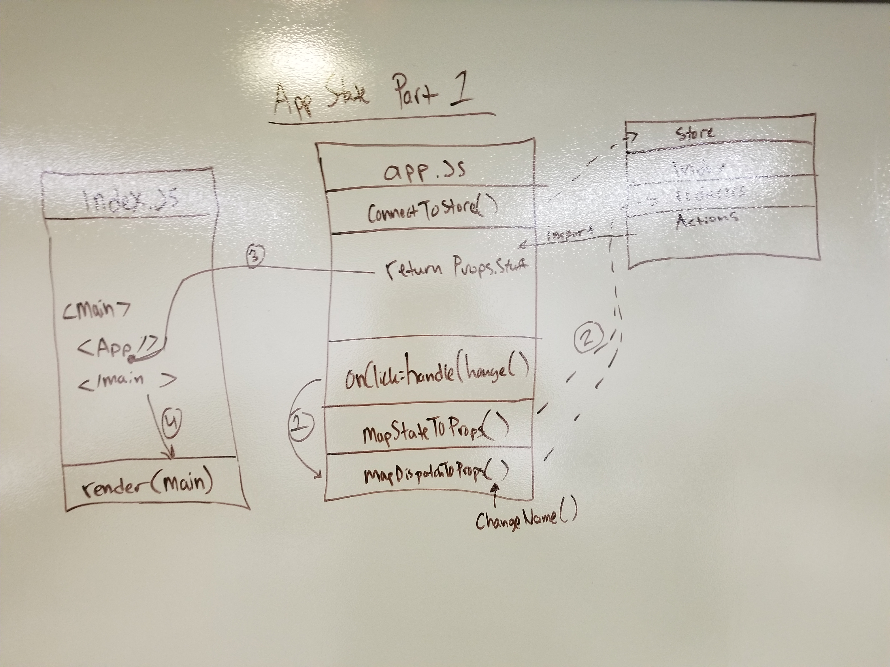
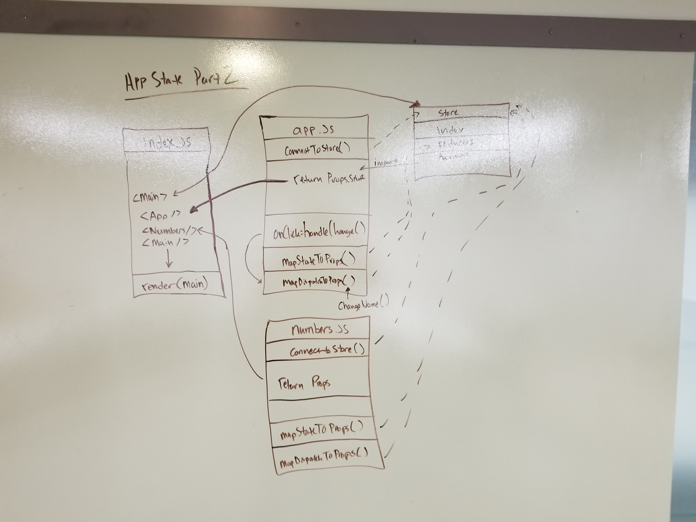

## Application State
State Part 1 is simple React app using a Redux store. State Part 2 is a slightly more involved example of how to use a Redux store. Follow the links below to view the apps. 

### Links
* [State Part 1 Code Sandbox](https://codesandbox.io/s/oj4mjrln8q)
* [State Part 2 Code Sandbox](https://codesandbox.io/s/4rky54r76w)

#### UML

